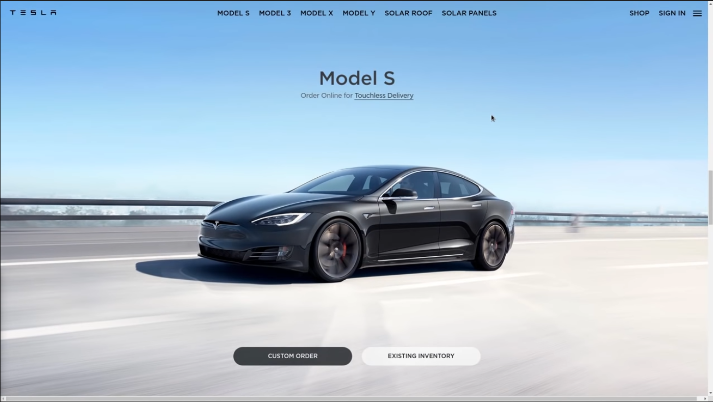

 

<h1>Tesla UI Clone :books:</h1>

This project was developed with React and TypeScript, had as objective to clone the tesla website interface..

<h3 align="center">
:pushpin:Tool used to develop the project:
</h3>
This project was developed in Visual Studio Code  
June 2021 (version 1.58) <a href="https://code.visualstudio.com/">Visual Studio Code</a>

<h3 align="center">
 :pushpin:Language
<h3>

<h3 align="center"><a href="https://www.tesla.com/">Official tesla website</a></h3>

